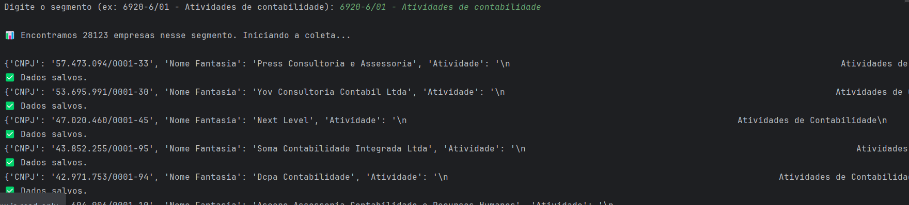
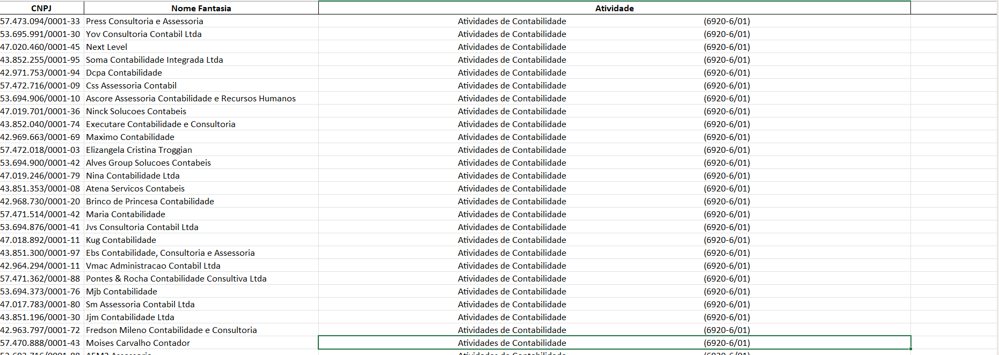
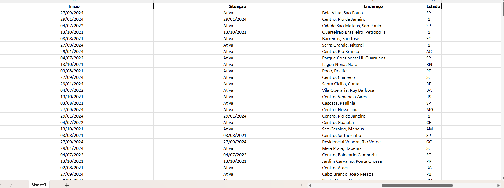
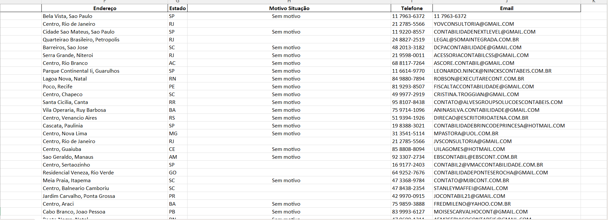

# 🧠 Coletor CNAE – Autenticator M&H Soluções

Sistema automatizado para **coleta de empresas por segmento (CNAE)** com autenticação e licenciamento integrado.  
Permite extrair CNPJs, nomes, endereços, e contatos diretamente de fontes públicas de dados empresariais, salvando tudo em planilhas Excel prontas para prospecção.

---

## 🖼️ Exemplo de Entrada e Resultados

### Entrada (terminal)


### Resultados Gerados
| Resultado 1 | Resultado 2 | Resultado 3 |
|--------------|--------------|--------------|
|  |  |  |

---

## ⚙️ Funcionalidades Principais

### 🔐 Licenciamento Automático (Hotmart)
- Ativação vinculada à máquina via **APPDATA** (`license.json`)  
- Comunicação com o servidor remoto **Autenticator M&H**  
- Verificação e revalidação automática a cada execução  
- Suporte a ativação manual via chave ou automática via e-mail da compra  

### 🏢 Coleta de Empresas por CNAE
- Entrada no formato:  
  `6920-6/01 - Atividades de contabilidade`
- Geração automática do link e nome do arquivo  
- Extração de dados completos por empresa:
  - **CNPJ**
  - **Nome Fantasia**
  - **Atividade Principal**
  - **Data de Início**
  - **Situação Cadastral**
  - **Endereço**
  - **Estado**
  - **Telefone / E-mail**

### ⚡ Execução Paralela (Multithread)
- Uso de **ThreadPoolExecutor** para processamento simultâneo  
- Divisão automática de páginas em 5 threads  
- Salvamento incremental em `.xlsx` durante a coleta  

---

## 🧩 Tecnologias Utilizadas

| Tecnologia | Função |
|-------------|--------|
| **Python 3.11+** | Linguagem principal |
| **Playwright** | Automação de scraping |
| **Pandas + OpenPyXL** | Manipulação e gravação de planilhas |
| **Requests** | Comunicação com servidor de ativação |
| **ThreadPoolExecutor** | Execução paralela |
| **UUID / JSON / OS** | Gestão de licença e identificação |

---

## 📁 Estrutura do Projeto

ColetorCNAE/
│
├── coletor_cnae.py # Script principal
├── requirements.txt # Dependências do projeto
├── README.md # Documentação principal
│
├── docs/ # Screenshots e exemplos
│ ├── input.png
│ ├── Resultado1.png
│ ├── Resultado2.png
│ └── Resultado3.png
│
└── data/ # Resultados e logs
├── <descricaoCNAE>.xlsx
└── logs/


---

## 🧠 Fluxo de Execução

1️⃣ O usuário executa o script  
2️⃣ O sistema verifica a licença:
   - Se válida → continua
   - Se ausente → solicita o e-mail de compra  
3️⃣ O sistema ativa automaticamente via servidor Hotmart  
4️⃣ O usuário informa o **segmento CNAE**  
5️⃣ O script coleta os dados e salva automaticamente no Excel  

---

## 🧩 Requisitos

- **Python 3.11+**
- Instalar dependências:

```bash
pip install -r requirements.txt
playwright install
| CNPJ               | Nome Fantasia    | Atividade                   | Início     | Situação | Endereço            | Estado | Telefone        | E-mail                                            |
| ------------------ | ---------------- | --------------------------- | ---------- | -------- | ------------------- | ------ | --------------- | ------------------------------------------------- |
| 12.345.678/0001-99 | Contábil Floripa | Atividades de contabilidade | 10/05/2018 | Ativa    | Rua das Flores, 123 | SC     | (48) 99999-9999 | [contato@empresa.com](mailto:contato@empresa.com) |
