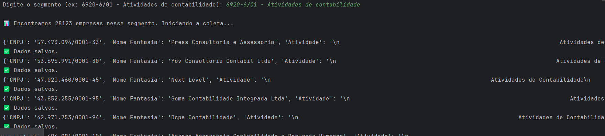
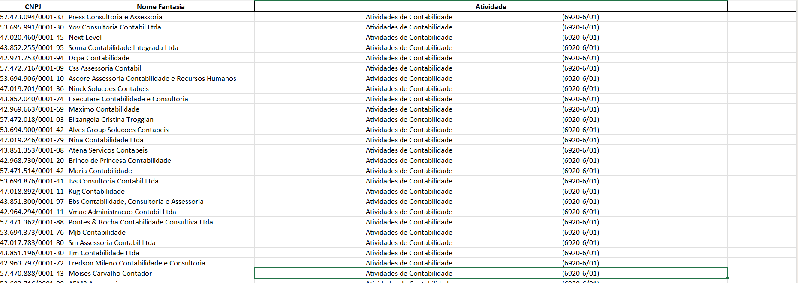
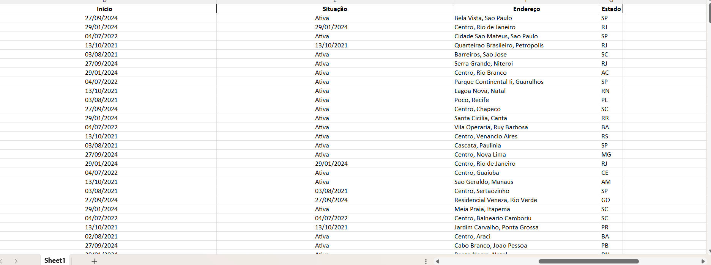
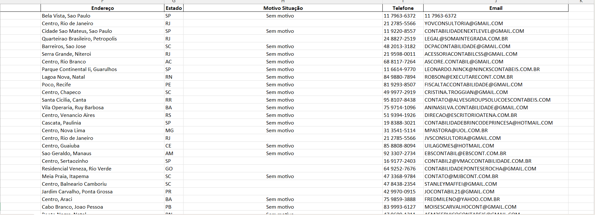

# ⚙️ Coletor Automação  
**Sistema de automação em Python para coleta de dados empresariais e geração de relatórios — distribuído como executável (.exe)**

---

### 📖 Descrição  
O **Coletor Automação** é um sistema desenvolvido em **Python** e empacotado em **.exe** através do **PyInstaller**, permitindo execução direta em Windows sem necessidade de instalar dependências.  
Ele automatiza a coleta de dados em portais públicos, organiza as informações em planilhas e gera relatórios padronizados com total rastreabilidade.

Projetado para uso corporativo, o sistema oferece uma interface simples e operação 100% autônoma, reduzindo significativamente o tempo gasto em consultas manuais.

---

### ⚙️ Principais funcionalidades  
- 🔍 Coleta automatizada de dados empresariais (CNPJ, CNAE, endereço, situação cadastral etc.)  
- 📦 Extração e padronização de informações em planilhas Excel  
- 🧠 Integração com APIs e uso de **Pandas** para tratamento de dados  
- ⚡ Execução multi-thread para maior desempenho  
- 🪶 Logs detalhados de execução e resultados exportáveis  
- 💻 Distribuição em formato `.exe`, executável em qualquer máquina Windows  

---

### 🧠 Tecnologias utilizadas  
| Categoria | Ferramentas |
|------------|--------------|
| **Linguagem** | Python 3.11+ |
| **Bibliotecas principais** | Playwright, Pandas, OpenPyXL, Regex, Logging |
| **Empacotamento** | PyInstaller |
| **Automação e RPA** | Playwright, ThreadPoolExecutor |
| **Relatórios** | Excel (.xlsx) |
| **Ambiente de execução** | Windows (standalone executável) |

---

### 🚀 Como executar o projeto  
O sistema é distribuído como arquivo **`.exe`** pronto para uso.

1. **Baixe o executável** da versão mais recente na aba *Releases* do repositório.  
2. **Execute o arquivo `ColetorAutomacao.exe`**.  
3. O sistema iniciará automaticamente e exibirá o progresso da coleta em tempo real.  
4. Os relatórios e planilhas serão salvos automaticamente na pasta `outputs/`.

Caso prefira rodar em modo desenvolvedor, você pode clonar o repositório e executar via Python:


```bash
git clone https://github.com/luccasflores/ColetorAutomacao
cd ColetorAutomacao
pip install -r requirements.txt
python coletor.py
```

🧩 Estrutura do projeto:
ColetorAutomacao/
├── coletor.py
├── docs/
│   ├── input.png
│   ├── Resultado1.png
│   ├── Resultado2.png
│   ├── Resultado3.png
├── outputs/
│   └── resultados.xlsx
├── build/
│   └── ColetorAutomacao.exe
└── requirements.txt

🎥 Demonstração

### 🎥 Demonstração  

**Entrada de dados (tela inicial):**  
  
*Usuário insere parâmetros de busca e inicia a coleta.*

**Resultados gerados automaticamente:**  
  
*Exemplo de planilha gerada após a coleta.*

  
*Exibição dos dados coletados com formatação padronizada.*

  
*Resumo final da execução e relatório consolidado.*


📈 Impacto e resultados

⏱️ Redução de horas de trabalho manual em processos de coleta de dados.

📊 Padronização dos relatórios corporativos em Excel.

🔗 Integração facilitada com sistemas SaaS e CRMs.

🧩 Portabilidade total via .exe, sem necessidade de instalação.

---

### 🧩 Autor  
**Luccas Flores**  
💻 Desenvolvedor Python | Especialista em RPA e automação de processos  
📧 [luccasflores.dev@gmail.com](mailto:luccasflores.dev@gmail.com)  
🔗 [LinkedIn](https://www.linkedin.com/in/luccas-flores-038757231/)

---

### 📝 Licença  
Este projeto está sob a **licença MIT** — você pode usar, copiar, modificar e distribuir livremente, desde que mantenha os créditos ao autor original.  
Para mais detalhes, consulte o arquivo [LICENSE](LICENSE).

